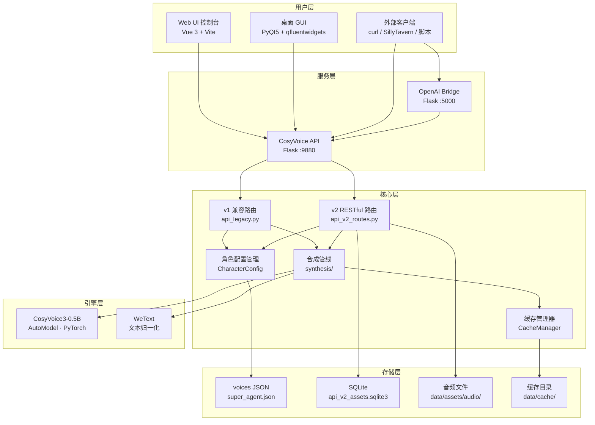
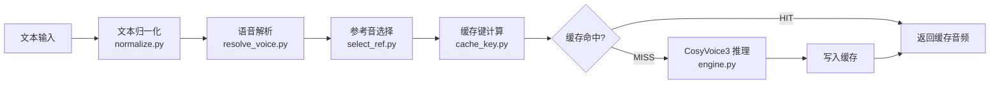

<p align="center">
  
</p>

<h1 align="center">CosyVoice WebUI + API</h1>

<p align="center">
  <strong>基于阿里巴巴 CosyVoice3 引擎的本地化 TTS Web 工作站、桌面兼容入口与 API 服务</strong>
</p>

<p align="center">
  
  
  
  
  
</p>

<p align="center">
  WebUI 主线 · HTTP API（v1/v2）· OpenAI 兼容桥接 · 多角色多情绪 · 语音克隆 · 批量合成
</p>

---

## 目录

- [功能特性](#功能特性)
- [系统架构](#系统架构)
- [目录结构](#目录结构)
- [快速开始](#快速开始)
  - [环境要求](#环境要求)
  - [安装步骤](#安装步骤)
  - [启动方式](#启动方式)
- [入口选择](#入口选择)
- [桌面 GUI 功能（Legacy）](#桌面-gui-功能legacy)
- [API 文档](#api-文档)
  - [v1 兼容接口](#v1-兼容接口端口-9880)
  - [v2 RESTful 接口](#v2-restful-接口前缀-apiv2)
  - [OpenAI 兼容桥接](#openai-兼容桥接端口-5000)
- [语音配置规范（Voice Config Spec）](#语音配置规范voice-config-spec)
- [配置参考](#配置参考)
- [日志系统（v2）](#日志系统v2)
- [真实回归](#真实回归)
- [插件与扩展规范](#插件与扩展规范)
- [常见问题（FAQ）](#常见问题faq)
- [更新日志](#更新日志)
- [许可证](#许可证)

---

## 功能特性

| 类别 | 功能 | 说明 |
|------|------|------|
| 语音合成 | 多角色多情绪 TTS | 支持 `voice_id = 角色#情绪` 格式，一个角色可配置多种情绪 |
| 语音克隆 | 零样本复制 | 上传参考音频即可克隆任意音色，无需训练 |
| 风格控制 | 指令控制 / 精细控制模式 | `精细控制` 基于参考音频迁移风格；`指令控制` 通过 `instruct_text` + 参考音频控制语气 |
| 批量合成 | 任务计划系统 | 支持多段文本批量生成，导出 JSON 任务计划 |
| API 服务 | v1 + v2 双版本 HTTP API | REST 风格，支持资产管理、CRUD 操作、异步任务 |
| OpenAI 兼容 | Bridge 桥接服务 | `POST /v1/audio/speech` 兼容 OpenAI TTS API |
| 酒馆集成 | SillyTavern 兼容 | 内置 `/speakers`、`/` 等酒馆端点 |
| 缓存系统 | 智能合成缓存 | 基于 SHA1 的缓存键策略，避免重复合成 |
| 资产管理 | v2 参考音频资产 | SQLite 索引，支持上传/绑定/清理/引用追踪 |
| 日志系统 | 日志 v2（中文优先） | 统一事件模型 `LogEventV1`、崩溃闭环、结构化 `jsonl`、平滑兼容旧日志 |
| 桌面 GUI | PyQt5 + Fluent Design | 兼容入口，保留多页面导航与历史工作流 |
| 局域网访问 | LAN 共享 | 默认监听 `0.0.0.0`，局域网设备直接调用 |

---

## 入口选择

当前推荐入口：

1. **WebUI（主线）**：优先使用 `StartWebUI.bat`
2. **API 服务**：需要外部调用或桥接时使用 `StartAPIServer.bat`
3. **桌面 GUI（Legacy）**：仅作为兼容和回退入口，优先级低于 WebUI

当前项目状态：

1. WebUI 是后续功能整合主线
2. 桌面 GUI 进入 legacy / maintenance 路线
3. 新能力优先落在 WebUI，而不是 `ui/`

## 真实回归

WebUI 提供两套验证入口：

1. `npm run smoke`
   说明：纯 mock 前端 smoke，适合日常改动后的快速回归。
2. `npm run regression:real`
   说明：真实后端回归脚本，直接请求实际 `/api/v2/*` 和 `/api/v2/pro/*` 接口。

在 `web_ui/` 下运行真实回归时，至少需要设置：

```powershell
$env:WEBUI_REAL_BASE_URL="http://127.0.0.1:9880"
$env:WEBUI_REAL_MODE="no-auth"
npm run regression:real
```

可选环境变量：

- `WEBUI_REAL_API_KEY`：启用 API Key 鉴权时填写
- `WEBUI_REAL_BRIDGE_URL`：本地桥接模式时填写，例如 `http://127.0.0.1:9879`
- `WEBUI_REAL_ALLOW_SYSTEM_ACTIONS=1`：允许脚本实际调用模型重载/卸载和桥接 ensure-runtime
- `WEBUI_REAL_BATCH_TEXT`：真实批量任务的测试文本

推荐按四种场景分别执行：

1. 无鉴权
2. 有鉴权
3. 本地桥接模式
4. 远程服务模式

---

## 系统架构



### 合成管线流程



---

## 目录结构

```
CosyVoiceDesktop/
│
├── 📄 main.py                    # 桌面 GUI 入口
├── 📄 bridge.py                  # OpenAI 兼容桥接服务 (:5000)
├── 📄 app_config.json            # 全局应用配置
├── 📄 icon.ico                   # 应用图标
│
├── 🔧 StartWebUI.bat             # 一键启动全新 Web UI 控制台 (Vue 3)
├── 🔧 StartCosyVoice.bat         # 一键启动桌面程序 (PyQt5)
├── 🔧 StartAPIServer.bat         # 一键启动 API + Bridge 服务
├── 🔧 DownloadModel.bat          # 一键下载预训练模型
├── 🔧 restore_onnx_cpu.bat       # 恢复 onnxruntime CPU 版本
│
├── 📁 core/                      # 后端核心逻辑
│   ├── api.py                    # API 入口（兼容包装器）
│   ├── api_legacy.py             # v1 API 主实现（路由、模型加载、合成）
│   ├── api_v2_routes.py          # v2 RESTful 路由（资产/voices/jobs/merge）
│   ├── models.py                 # 数据模型定义
│   ├── worker.py                 # 后台合成工作线程
│   ├── cache_manager.py          # 合成结果缓存管理
│   ├── cache_keys.py             # 缓存键生成策略
│   ├── config_manager.py         # 应用配置管理器
│   ├── download.py               # 模型下载脚本
│   ├── emotion_selector.py       # 情绪选择器
│   ├── utils.py                  # 通用工具函数
│   │
│   ├── 📁 logging/               # 日志 v2 子系统
│   │   ├── schema.py             # LogEventV1 结构与事件字段约束
│   │   ├── runtime.py            # 日志运行时（队列、路由、轮转、降噪）
│   │   ├── crash.py              # 崩溃捕获（sys/thread/Qt/faulthandler）
│   │   ├── redaction.py          # 日志脱敏（文本/路径/token/headers）
│   │   └── compat.py             # 旧日志兼容（平滑双写）
│   │
│   ├── 📁 server/                # 服务器启动框架
│   │   ├── main.py               # 服务器启动入口
│   │   ├── app.py                # Flask 应用工厂
│   │   ├── ctx.py                # 上下文对象
│   │   └── routes_v2_misc.py     # v2 辅助路由
│   │
│   ├── 📁 synthesis/             # 统一合成管线
│   │   ├── __init__.py           # 管线公开接口
│   │   ├── engine.py             # 合成引擎核心
│   │   ├── normalize.py          # 文本归一化（清洗、分句）
│   │   ├── request.py            # 合成请求对象
│   │   ├── resolve_voice.py      # 语音配置解析
│   │   ├── select_ref.py         # 参考音频选择策略
│   │   └── cache_key.py          # 合成缓存键计算
│   │
│   ├── 📁 storage/               # 持久化存储
│   │   └── voices_file.py        # v2 voices JSON 文件读写
│   │
│   └── 📁 v2/                    # v2 子系统
│       ├── assets_sqlite.py      # v2 资产 SQLite 存储
│       ├── errors.py             # v2 错误定义
│       ├── http.py               # v2 HTTP 中间件
│       ├── legacy_import.py      # 旧配置迁移工具
│       ├── logging.py            # v2 日志工具
│       └── request_id.py         # 请求 ID 生成
│
├── 📁 ui/                        # 桌面界面（PyQt5）
│   ├── main_window.py            # 主窗口（导航、生命周期）
│   ├── text_edit.py              # 文本编辑页面
│   ├── task_plan.py              # 任务计划页面
│   ├── voice_settings.py         # 语音设置页面
│   ├── emotion_voices.py         # 情绪语音管理页面
│   ├── voice_library_dialog.py   # 语音库对话框
│   ├── voice_setup_wizard.py     # 语音设置向导
│   ├── api_page.py               # API 服务管理页面
│   ├── settings.py               # 全局设置页面
│   ├── asset_cleanup_dialog.py   # 资产清理对话框
│   ├── v2_client.py              # v2 API 客户端（UI 内部调用）
│   │
│   └── 📁 components/            # UI 组件
│       ├── emotion_assets_panel.py  # 情绪资产面板
│       └── voice_refs_sheet.py      # 参考音频表单
│
├── web_ui/                      # 新一代 Web 前端 (Vue 3 + Vite)
│   ├── src/                      # 前端源代码
│   ├── package.json              # 依赖配置
│   └── vite.config.ts            # 构建配置
│
├── 📁 config/                    # 配置文件
│   ├── super_agent.json          # v2 推荐角色配置（voice_id 格式）
│   ├── config.json               # v1 兼容角色配置
│   └── voice_config.json         # 替代角色配置
│
├── 📁 cosyvoice/                 # CosyVoice 推理引擎（上游代码）
│   ├── cli/                      # 命令行接口 & AutoModel
│   ├── flow/                     # Flow Matching 模块
│   ├── hifigan/                  # HiFi-GAN 声码器
│   ├── llm/                      # LLM 语言模型
│   ├── transformer/              # X-Transformer 架构
│   ├── tokenizer/                # Tokenizer
│   └── utils/                    # 引擎工具函数
│
├── 📁 pretrained_models/         # 预训练模型
│   ├── Fun-CosyVoice3-0.5B/     # CosyVoice3 主模型
│   └── wetext/                   # WeText 文本归一化模型
│
├── 📁 client/                    # API 客户端库
│   ├── api_client.py             # CosyVoiceAPIClient（v2 优先、v1 回退）
│   └── simple_ui.py              # 简易客户端 UI
│
├── 📁 data/                      # 运行时数据
│   ├── api_v2_assets.sqlite3     # v2 资产索引数据库
│   ├── assets/audio/             # 参考音频资产文件
│   ├── cache/                    # 合成结果缓存
│   ├── logs/                     # 运行日志（app.log/access.jsonl/crash.log）
│   └── outputs/                  # 输出音频文件
│
├── 📁 asset/                     # 内置示例参考音频
├── 📁 output/                    # 桌面 GUI 输出目录
│
├── 📁 scripts/                   # 工具脚本
│   ├── import_legacy_voice_config_to_v2.py   # v1→v2 配置迁移
│   ├── migrate_cache_index_json_to_sqlite.py # 缓存索引迁移
│   ├── migrate_v2_assets_json_to_sqlite.py   # 资产索引迁移
│   ├── export_diagnostic_bundle.py           # 导出问题诊断包（日志+配置摘要）
│   └── benchmarks/               # 性能基准测试
│
├── 📁 tests/                     # 自动化测试
│   ├── test_synthesis_engine_cache.py    # 合成缓存测试
│   ├── test_synthesis_engine_errors.py   # 合成错误处理测试
│   ├── test_synthesis_key_parity.py      # 缓存键一致性测试
│   ├── test_synthesis_normalization.py   # 文本归一化测试
│   ├── test_voices_store_m4.py           # v2 Voices Store 测试
│   ├── test_logging_schema.py            # 日志 schema 与事件码校验
│   ├── test_logging_redaction.py         # 日志脱敏规则测试
│   └── test_logging_compat.py            # 旧日志兼容解析测试
│
├── 📁 docs/                      # 项目文档
│   ├── log_event_dictionary_v1.md # 日志事件字典（字段与事件码）
│   └── log_triage_runbook.md      # 闪退排障 Runbook
├── 📁 third_party/               # 第三方依赖
├── 📁 deprecated/                # 已废弃代码
│
├── 📄 API_USAGE.md               # API 使用详细文档
├── 📄 PROJECT_OVERVIEW.md        # 项目概览
├── 📄 LICENSE                    # Apache 2.0 许可证
└── 📄 web_api_console.html       # Web API 控制台（浏览器测试）
```

---

## 快速开始

### 环境要求

| 依赖项 | 最低版本 | 说明 |
|--------|---------|------|
| **操作系统** | Windows 10+ | 目前仅支持 Windows |
| **Python** | 3.10+ | 推荐使用 pixi 内置环境 |
| **PyTorch** | 2.7.0+ | 需要 CUDA 支持 |
| **CUDA** | 12.8+ | 用于 GPU 加速推理 |
| **显存** | ≥ 4GB | CosyVoice3-0.5B 模型 |
| **FFmpeg** | 任意版本 | 用于音频格式转换和变速 |
| **磁盘空间** | ≥ 5GB | 模型 + 运行环境 |

### 安装步骤

#### 方式一：下载完整包（推荐）

1. 从 [GitHub Releases](../../releases) 下载最新的 `CosyVoiceDesktop_v1.4.7z`
2. 解压到任意目录
3. 双击 `DownloadModel.bat` 下载预训练模型（如未附带）
4. 双击 `StartCosyVoice.bat` 启动桌面程序

#### 方式二：从源码安装

```powershell
# 1. 克隆仓库
git clone https://github.com/Moeary/CosyVoice-Desktop.git
cd CosyVoice-Desktop

# 2. 安装 pixi 环境（推荐）
pixi install

# 3. 下载预训练模型
# 方式 A: 从 ModelScope 下载（国内推荐）
DownloadModel.bat

# 方式 B: 手动下载到 pretrained_models/ 目录
#   - Fun-CosyVoice3-0.5B
#   - wetext

# 4. 启动
StartCosyVoice.bat
```

### 启动方式

| 场景 | 命令 | 说明 |
|------|------|------|
| Web UI（推荐） | `StartWebUI.bat` | 启动主线 Vue 3 浏览器工作站 |
| API 服务 | `StartAPIServer.bat` | 启动 API (:9880) + Bridge (:5000) |
| 桌面 GUI（Legacy） | `StartCosyVoice.bat` | 启动历史桌面入口，用于兼容和回退 |
| 仅 API | `.pixi\envs\default\python.exe core\api.py --config config\super_agent.json --host 0.0.0.0 --port 9880` | 手动启动核心 API |
| 仅桥接 | `.pixi\envs\default\python.exe bridge.py` | 手动启动 OpenAI Bridge |

### WebUI 验证

```powershell
cd web_ui
npm install
npm run smoke:install
npm run smoke
```

说明：

1. `smoke` 会构建 WebUI，并对 `Pro Workspace` 主流程做最小浏览器检查
2. 失败截图会输出到 `web_ui/output/playwright/`

---

## 🖥️ 桌面 GUI 功能（Legacy）

桌面端采用 **PyQt5 + [QFluentWidgets](https://github.com/zhiyiYo/PyQt-Fluent-Widgets)** 构建，目前作为 legacy 兼容入口保留。

### 页面导航

| 页面 | 模块 | 功能描述 |
|------|------|---------|
| **文本编辑** | `text_edit.py` | 输入文本、选择角色/情绪、一键合成、试听播放 |
| **任务计划** | `task_plan.py` | 多段文本批量编辑、导入/导出 JSON 任务、批量生成 |
| **语音设置** | `voice_settings.py` | 角色 CRUD、参考音频绑定、情绪分组管理 |
| **情绪语音** | `emotion_voices.py` | 按角色-情绪维度管理语音变体与参考音频 |
| **API 管理** | `api_page.py` | 内嵌 API 服务启停、日志实时查看、状态监控 |
| **全局设置** | `settings.py` | 模型路径、主题切换（Light/Dark）、FP16 开关等 |

### 核心交互

- **一键运行**：在文本编辑页输入内容 → 选择角色 → 点击合成 → 自动播放
- **批量合成**：在任务计划页配置多段任务 → 一键生成全部 → 合并为长音频
- **语音向导**：`voice_setup_wizard.py` 提供新角色配置的分步引导
- **语音库**：`voice_library_dialog.py` 支持浏览、搜索、快速切换已有角色
- **资产清理**：`asset_cleanup_dialog.py` 可识别未被引用的参考音频并批量清理

---

## 🔌 API 文档

> 完整的 API 使用文档请参阅 [API_USAGE.md](API_USAGE.md)

### v1 兼容接口（端口 9880）

| 方法 | 端点 | 说明 |
|------|------|------|
| `GET` | `/api/health` | 健康检查，返回模型状态和角色列表 |
| `GET` | `/api/characters` | 获取所有角色 |
| `GET` | `/speakers` | 酒馆兼容角色列表 |
| `POST` | `/api/tts` | **标准 TTS**：`text` + `character_name` + `mode` + `speed` |
| `POST` | `/api/tts_direct` | **直接零样本 TTS**：必须提供参考音频（multipart 或 base64）与 `prompt_text` |
| `GET/POST` | `/` | 酒馆兼容端点：`text` + `speaker` + `speed` |
| `POST` | `/api/toggle_stream` | 开关流式输出 |
| `POST` | `/api/toggle_spk_cache` | 开关说话人缓存 |

#### 快速示例

```bash
# 健康检查
curl http://127.0.0.1:9880/api/health

# 标准 TTS
curl -X POST "http://127.0.0.1:9880/api/tts" \
  -H "Content-Type: application/json" \
  -d '{"text":"你好世界","character_name":"胡桃#default","speed":1.0}' \
  --output hello.wav
```

### v2 RESTful 接口（前缀 `/api/v2`）

v2 是功能完整的 RESTful API，支持资产管理、CRUD 操作和异步任务。

#### 认证

设置环境变量 `V2_API_KEY`（或 `API_KEY`）启用鉴权：

```
X-API-Key: <key>
# 或
Authorization: Bearer <key>
```

#### 端点一览

| 类别 | 方法 | 端点 | 说明 |
|------|------|------|------|
| **健康** | `GET` | `/api/v2/health` | 健康检查 |
| **资产** | `POST` | `/api/v2/assets/audio` | 上传参考音频 |
| | `GET` | `/api/v2/assets/audio` | 列出所有音频资产 |
| | `GET` | `/api/v2/assets/audio/{id}` | 获取资产元数据 |
| | `PUT` | `/api/v2/assets/audio/{id}` | 更新资产元数据 |
| | `GET` | `/api/v2/assets/audio/{id}/content` | 下载音频内容 |
| | `DELETE` | `/api/v2/assets/audio/{id}` | 删除音频资产 |
| **Voices** | `GET` | `/api/v2/voices` | 列出所有语音配置 |
| | `POST` | `/api/v2/voices` | 创建语音配置 |
| | `GET` | `/api/v2/voices/{id}` | 获取单个语音配置 |
| | `PUT` | `/api/v2/voices/{id}` | 更新语音配置 |
| | `DELETE` | `/api/v2/voices/{id}` | 删除语音配置 |
| | `POST` | `/api/v2/voices/{id}/compile` | 预编译语音（缓存 spk） |
| | `POST` | `/api/v2/voices/reload` | 从磁盘重新加载配置 |
| **合成** | `POST` | `/api/v2/synthesize` | 统一合成接口 |
| **任务** | `POST` | `/api/v2/jobs` | 创建异步批量任务 |
| | `GET` | `/api/v2/jobs/{id}` | 查询任务状态 |
| | `POST` | `/api/v2/jobs/{id}/cancel` | 取消任务 |
| | `POST` | `/api/v2/jobs/{id}/retry` | 重试任务 |
| **合并** | `POST` | `/api/v2/merge` | 合并多个音频文件 |
| **清理** | `GET` | `/api/v2/assets/audio/unused` | 列出未引用的资产 |
| | `POST` | `/api/v2/assets/audio/cleanup` | 批量清理（支持 dry-run） |

#### v2 合成请求示例

```bash
# 使用 voice_id 合成
curl -X POST "http://127.0.0.1:9880/api/v2/synthesize" \
  -H "Content-Type: application/json" \
  -d '{
    "text": "你好世界",
    "voice_id": "胡桃#default",
    "speed": 1.0,
    "response_format": "audio"
  }' \
  --output hello.wav
```

#### v2 响应规范

- **成功**：JSON 响应包含 `request_id`；音频响应为 `audio/wav` 流
- **缓存头**：`X-Cache: HIT|MISS`、`X-Cache-Key`、`X-Asset-Id`
- **请求追踪**：客户端可传 `X-Request-Id`，服务端在响应头回传
- **错误格式**：

```json
{
  "error": { "code": "voice_not_found", "message": "..." },
  "request_id": "req_xxx"
}
```

| 错误码 | HTTP 状态 | 说明 |
|--------|-----------|------|
| `invalid_request` | 400 | 参数缺失或格式错误 |
| `unauthorized` | 401 | 未通过 API Key 鉴权 |
| `voice_not_found` | 404 | 角色/音色不存在 |
| `asset_not_found` | 404 | 资产不存在 |
| `job_not_found` | 404 | 任务不存在 |
| `conflict` | 409 | 资源冲突（如 voice 已存在） |
| `payload_too_large` | 413 | 上传体积超限（默认 50MB） |
| `model_not_loaded` | 503 | 模型未加载 |
| `internal_error` | 500 | 未预期错误 |

### OpenAI 兼容桥接（端口 5000）

`bridge.py` 提供 OpenAI `/v1/audio/speech` 兼容端点，可直接对接支持 OpenAI TTS 的客户端。

```bash
curl -X POST "http://127.0.0.1:5000/v1/audio/speech" \
  -H "Content-Type: application/json" \
  -d '{"input":"你好世界","voice":"胡桃#default"}' \
  --output hello.wav
```

**技术细节**：
- 内部转发到 `POST /api/v2/synthesize`
- 线程安全：使用 `threading.Lock()` 串行化请求
- 透传 `X-Request-Id` 便于问题排查
- 健康检查：`GET /health`

---

## 🎭 语音配置规范（Voice Config Spec）

语音配置文件（推荐 `config/super_agent.json`）定义所有可用的角色和情绪变体。

### v2 格式（推荐）

```json
[
  {
    "name": "胡桃#default",
    "character": "胡桃",
    "emotion": "default",
    "mode": "零样本复制",
    "prompt_text": "唷，找本堂主有何贵干呀？...",
    "prompt_audio": "data/assets/audio/ref_xxx.wav",
    "instruct_text": "",
    "color": "#FF6B6B",
    "selection_policy": "random_per_text",
    "ref_asset_ids": ["ref_xxx"]
  }
]
```

### 字段说明

| 字段 | 类型 | 必填 | 说明 |
|------|------|------|------|
| `name` | `string` | ✅ | 唯一标识，格式 `角色名#情绪`，即 `voice_id` |
| `character` | `string` | ✅ | 角色名称（用于 UI 分组） |
| `emotion` | `string` | ✅ | 情绪标签（`default`, `happy`, `sad`, `calm`, `surprise`, `disgust` 等） |
| `mode` | `string` | ✅ | 推理模式：`零样本复制` / `精细控制` / `指令控制` |
| `prompt_text` | `string` | ✅ | 参考音频对应的文本（用于对齐） |
| `prompt_audio` | `string` | ✅ | 参考音频文件路径 |
| `instruct_text` | `string` | ❌ | 指令文本（仅 `指令控制` 模式使用） |
| `color` | `string` | ❌ | UI 显示颜色（HEX 格式） |
| `selection_policy` | `string` | ❌ | 参考音频选择策略：`random_per_text` / `first` |
| `ref_asset_ids` | `string[]` | ❌ | v2 资产 ID 列表（支持多参考音频） |

### 语音 ID 命名规范

```
voice_id = {character}#{emotion}
```

示例：
- `胡桃#default` — 默认情绪
- `胡桃#happy` — 开心
- `芙宁娜#sad` — 悲伤
- `钟离#default` — 默认情绪

### 推理模式说明

| 模式 | 说明 | 必填参数 |
|------|------|---------|
| `零样本复制` | 基于参考音频克隆音色，最常用 | `prompt_text` + `prompt_audio` |
| `参考音色` | 与零样本同推理路径，可结合说话人缓存 | `prompt_text` + `prompt_audio` |
| `精细控制` | 调用 cross-lingual 风格迁移（项目模式名为“精细控制”） | `prompt_audio`（建议同时提供 `prompt_text`） |
| `指令控制` | 调用 instruct2，通过自然语言描述语气/风格 | `instruct_text` + `prompt_audio`（建议同时提供 `prompt_text`） |

> **重要说明**
>
> 当前项目在 **CosyVoice3** 路径下，`指令控制` 仍需参考音频。  
> 不支持“只给指令文本、不提供参考音频”直接生成目标音色。

### CosyVoice3 能力覆盖现状

| 能力项 | 状态 | 说明 |
|------|------|------|
| 零样本复制（`inference_zero_shot`） | ✅ 已实现 | `POST /api/tts`、`POST /api/v2/synthesize`、`POST /api/tts_direct` 可用 |
| 指令控制（`inference_instruct2`） | ✅ 已实现 | `POST /api/tts`、`POST /api/v2/synthesize` 可用；需 `instruct_text` + 参考音频 |
| 精细控制（`inference_cross_lingual`） | ✅ 已实现 | 在本项目中对应“精细控制”模式 |
| 直连接口多模式能力 | ⚠️ 部分实现 | `POST /api/tts_direct` 当前仅实现零样本复制 |
| 仅指令无参考音频生成 | ❌ 未提供 | 当前模型调用链未开放该入口 |
| 默认配置开箱模式 | ⚠️ 以零样本为主 | `config/super_agent.json` 默认配置均为零样本复制，`instruct_text` 为空 |

---

## ⚙️ 配置参考

### `app_config.json`

| 字段 | 类型 | 默认值 | 说明 |
|------|------|--------|------|
| `theme` | `string` | `"Light"` | UI 主题（`Light` / `Dark`） |
| `voice_config_path` | `string` | `"config/config.json"` | v1 角色配置路径 |
| `v2_voices_config_path` | `string` | — | **v2 角色配置路径**（优先级最高） |
| `cosyvoice_model_path` | `string` | — | CosyVoice 模型目录 |
| `wetext_model_path` | `string` | — | WeText 模型目录 |
| `fp16` | `bool` | `true` | 启用半精度推理（节省显存） |
| `api_host` | `string` | `"127.0.0.1"` | API 监听地址 |
| `api_port` | `int` | `9880` | API 监听端口 |
| `api_key` | `string` | `""` | v2 API 鉴权密钥 |
| `auto_load_model` | `bool` | `true` | 启动时自动加载模型 |
| `ui_auto_start_api_server` | `bool` | `true` | 启动 GUI 时自动启动 API 服务 |
| `ui_use_v2_generation` | `bool` | `true` | UI 使用 v2 合成管线 |
| `min_text_length` | `int` | `3` | 最小文本长度 |
| `project_name` | `string` | `"project"` | 项目名称 |
| `output_dir` | `string` | `"./output"` | 输出目录 |
| `log_language` | `string` | `"zh-CN"` | 日志语言（`zh-CN` / `en-US` / `bilingual`） |
| `log_console_format` | `string` | `"human"` | 控制台格式（`human` / `json`） |
| `log_file_format` | `string` | `"jsonl"` | 文件日志格式（当前固定为 `jsonl`） |
| `log_level` | `string` | `"INFO"` | 日志级别（`DEBUG/INFO/WARNING/ERROR`） |
| `log_dir` | `string` | `"data/logs"` | 日志目录 |
| `log_third_party_mode` | `string` | `"quiet"` | 第三方日志噪声控制（`quiet/normal/verbose`） |
| `log_compat_mode` | `string` | `"smooth"` | 兼容模式（`smooth/legacy/strict`） |
| `log_schema_version` | `string` | `"1"` | 结构化日志 schema 版本 |
| `log_queue_max` | `int` | `10000` | 异步日志队列最大长度 |
| `log_drop_policy` | `string` | `"drop_debug_first"` | 队列满时丢弃策略 |

### 配置加载优先级

```
v2_voices_config_path (app_config.json)
    ↓ 如果为空
config/super_agent.json
    ↓ 如果不存在
config/voices_v2.json
```

---

## 🧾 日志系统（v2）

### 日志产物

- `data/logs/app.log`：中文人读日志（UI/业务主事件）
- `data/logs/access.jsonl`：结构化 API 访问日志（`API_REQ_*`）
- `data/logs/crash.log`：崩溃日志（未捕获异常、线程异常、Qt 致命消息）

### 关键设计

1. 统一事件模型：`LogEventV1`（`core/logging/schema.py`）
2. 中文优先展示：控制台与 UI 默认输出中文模板
3. 崩溃闭环：`sys.excepthook`、`threading.excepthook`、Qt message handler、`faulthandler` 全量接管
4. 平滑兼容：`log_compat_mode=smooth` 下双写（结构化 + 旧文本）
5. 日志治理：内置脱敏（文本摘要、路径裁剪、token/headers 掩码）与第三方降噪

### 快速排障

- 事件字典：`docs/log_event_dictionary_v1.md`
- 闪退流程：`docs/log_triage_runbook.md`
- 一键导出诊断包：

```powershell
python scripts/export_diagnostic_bundle.py
```

---

## 🧩 插件与扩展规范

### 添加新角色

1. 准备一段 3~10 秒的参考音频（WAV 格式，16kHz 以上，清晰无噪音）
2. 通过 GUI 的 **语音设置向导** 添加，或直接编辑 `config/super_agent.json`
3. 通过 API 添加：

```bash
# 1. 上传参考音频
curl -X POST "http://127.0.0.1:9880/api/v2/assets/audio" \
  -F "file=@reference.wav"
# 返回 asset_id

# 2. 创建 voice 配置
curl -X POST "http://127.0.0.1:9880/api/v2/voices" \
  -H "Content-Type: application/json" \
  -d '{
    "name": "新角色#default",
    "character": "新角色",
    "emotion": "default",
    "mode": "零样本复制",
    "prompt_text": "参考音频的文本内容",
    "ref_asset_ids": ["ref_xxxx"]
  }'
```

### 添加新情绪变体

为已有角色添加新的情绪维度：

```json
{
  "name": "胡桃#angry",
  "character": "胡桃",
  "emotion": "angry",
  "mode": "零样本复制",
  "prompt_text": "对应情绪的参考文本",
  "prompt_audio": "data/assets/audio/ref_angry.wav",
  "ref_asset_ids": ["ref_angry"]
}
```

### 自定义客户端集成

使用 `client/api_client.py` 中的 `CosyVoiceAPIClient`：

```python
from client.api_client import CosyVoiceAPIClient

client = CosyVoiceAPIClient(base_url="http://127.0.0.1:9880")

# 获取角色列表
voices = client.get_voices()

# 合成语音
audio_bytes = client.synthesize(
    text="你好世界",
    voice_id="胡桃#default",
    speed=1.0
)

with open("output.wav", "wb") as f:
    f.write(audio_bytes)
```

### SillyTavern（酒馆）集成

1. 在 SillyTavern TTS 设置中选择 **CosyVoice** 或 **Custom**
2. 填入服务地址：`http://<你的IP>:9880`
3. 角色映射使用 `/speakers` 端点自动获取

### 油猴脚本集成

项目支持通过 Tampermonkey 油猴脚本对接 Pixiv、爱丽丝书屋等小说网站，实现浏览器内直接朗读功能。

### Web API 控制台

项目附带 `web_api_console.html`，可在浏览器中直接测试 API 端点。

---

## ❓ 常见问题（FAQ）

### 🔴 模型加载失败

**症状**：启动时报错 `Model not found` 或 `CUDA out of memory`

**排查步骤**：
1. 确认 `pretrained_models/Fun-CosyVoice3-0.5B/` 和 `pretrained_models/wetext/` 目录存在且完整
2. 检查 `app_config.json` 中的 `cosyvoice_model_path` 和 `wetext_model_path` 路径
3. 确认显卡驱动正常，CUDA 版本 ≥ 12.8
4. 如显存不足（<4GB），尝试关闭其他占显存的程序

### 🔴 FFmpeg 不可用

**症状**：音频变速或格式转换失败

**解决方案**：
```powershell
# 确认 ffmpeg 在 PATH 中
ffmpeg -version

# 如未安装，推荐使用 winget
winget install Gyan.FFmpeg
```

### 🔴 API 返回 "角色不存在"

**排查步骤**：
1. 检查 `v2_voices_config_path` 指向的配置文件是否包含目标 `voice_id`
2. `voice_id` 格式必须完全匹配，如 `胡桃#default`（注意大小写和 `#` 分隔符）
3. 调用 `GET /api/v2/voices` 或 `GET /api/characters` 查看已加载的角色列表

### 🟡 指令控制可以不提供参考音频吗？

不可以。当前项目在指令模式下调用的是 CosyVoice3 的 `inference_instruct2`，仍然要求 `prompt_audio` 存在。  
如果没有参考音频，接口会返回错误并拒绝合成。

### 🟡 当前项目是否已经覆盖 CosyVoice3 的全部能力？

核心三条推理路径（零样本 / 指令 / 精细）已接入，但不是所有入口都完整开放：

1. `POST /api/tts_direct` 目前只支持零样本复制。
2. 默认 voice 配置以零样本为主；要启用指令模式需手动设置 `mode=指令控制` 并填写 `instruct_text`。
3. 当前未提供“仅指令、无参考音频”的生成入口。

### 🟡 乱码问题

本项目已统一使用 **UTF-8** 编码。若仍出现乱码：

1. 检查编辑器文件编码是否被强制改为 GBK/ANSI
2. 确认终端码页：启动脚本已执行 `chcp 65001`
3. 检查是否存在历史损坏文本（异常 emoji 前缀、中文标点错位、连续问号）

### 🟡 `No module named 'PIL'`

```powershell
# 使用 pixi 环境的 pip 安装
.pixi\envs\default\python.exe -m pip install Pillow
```

### 🟡 ONNX Runtime DLL 冲突

如遇 `onnxruntime` DLL 冲突，运行：
```bat
restore_onnx_cpu.bat
```

### 🟡 点击“语音合成”后闪退，先看哪些日志？

按顺序排查：

1. `data/logs/crash.log`（先看最后一条异常和线程名）
2. 同时间窗口 `data/logs/access.jsonl`（看 `API_REQ_START/END/FAIL`）
3. 同 `request_id` 在 `data/logs/app.log` 中串联 UI 与推理事件

如果需要反馈问题，建议直接执行：

```powershell
python scripts/export_diagnostic_bundle.py
```

把生成的 zip 诊断包附在 issue 中。

### 🟡 如何切换日志兼容模式？

在 `app_config.json` 设置 `log_compat_mode`：

- `smooth`：默认，双写（推荐）
- `legacy`：旧文本优先，结构化保底
- `strict`：仅结构化事件（便于机器处理）

### 🟡 局域网访问失败

1. 确认服务监听 `0.0.0.0`（`StartAPIServer.bat` 已默认设置）
2. 防火墙放行端口 9880 和 5000
3. 确认局域网设备可 ping 通服务端 IP
4. 获取本机 IP：`ipconfig` → 找 IPv4 地址

---

## 📜 更新日志

### v1.4.1

- 引入日志系统 v2（中文优先 + 结构化 `jsonl` + 事件字典）
- 新增 `core/logging/` 子系统：schema/runtime/crash/redaction/compat
- 新增 `app.log / access.jsonl / crash.log` 三通道路由
- 新增崩溃捕获闭环（`sys`/`thread`/Qt/`faulthandler`）
- 新增诊断包导出脚本：`scripts/export_diagnostic_bundle.py`
- 新增排障文档：`docs/log_event_dictionary_v1.md`、`docs/log_triage_runbook.md`

### v1.4

- 解决 issue #3、#4 提到的模型下载问题
- 增加更多语气标签支持
- 更新 API 服务，支持酒馆（SillyTavern）TTS 服务
- 支持油猴脚本对接 Pixiv、爱丽丝书屋等小说网站实现浏览器内直接朗读
- UI 交互优化：列宽拖动、日志主题适配
- 任务计划页面支持导出 JSON、页面内直接编辑内容
- 新增批量生成功能

### v1.3

- 升级 CosyVoice2 → **CosyVoice3**，语音语气显著提升
- 提供两种安装包：带模型版（百度网盘）和不带模型版（GitHub Release）
- 新增 `DownloadModel.bat` 支持从 HuggingFace / ModelScope 下载模型
- 引入 X-Transformer 架构

### v1.2

- 代码环境更新到 PyTorch 2.7.0 + CUDA 12.8
- 支持 RTX 50 系列显卡
- 精简模型文件夹体积
- 多项优化

### v1.1

- 整合 PIL 模块修复启动问题
- 删减不必要文件，减少磁盘占用

---

## 🏗️ 技术栈

| 组件 | 技术 | 版本/说明 |
|------|------|----------|
| TTS 引擎 | [CosyVoice3](https://github.com/FunAudioLLM/CosyVoice) | 0.5B 参数，Flow Matching + HiFi-GAN |
| 文本归一化 | WeText | 中文文本预处理 |
| 桌面 GUI | PyQt5 + [QFluentWidgets](https://github.com/zhiyiYo/PyQt-Fluent-Widgets) | Fluent Design 风格 |
| HTTP API | Flask + Flask-CORS | v1 兼容 + v2 RESTful |
| OpenAI 桥接 | Flask | `/v1/audio/speech` 兼容 |
| 数据库 | SQLite3 | v2 资产索引 |
| 推理框架 | PyTorch + CUDA | GPU 加速 |
| 音频处理 | torchaudio + FFmpeg | 格式转换、变速 |
| 环境管理 | [pixi](https://pixi.sh) | 自包含 Python 环境 |

---

## 🤝 贡献

欢迎通过以下方式参与贡献：

1. **Fork** 本仓库
2. 创建功能分支：`git checkout -b feature/amazing-feature`
3. 提交更改：`git commit -m 'feat: 添加了很棒的新功能'`
4. 推送分支：`git push origin feature/amazing-feature`
5. 提交 **Pull Request**

### 开发规范

- 编码统一使用 **UTF-8**
- 代码注释使用中文
- 提交前确保通过测试：`python -m pytest tests/`
- 禁止提交 GBK/ANSI 文件或乱码文本

---

## 📄 许可证

本项目基于 [Apache License 2.0](LICENSE) 开源。

```
Copyright 2025 Moeary

Licensed under the Apache License, Version 2.0
```

---

<p align="center">
  <sub>Made with ❤️ by <a href="https://github.com/Moeary">Moeary</a></sub>
</p>
