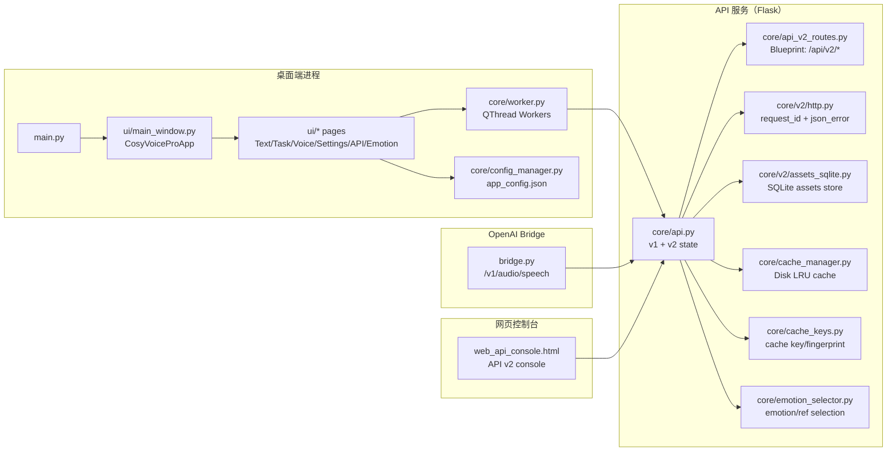

# CosyVoice Desktop（voice）架构报告（2026-02-10）

> 约束：本报告只做“读代码后的架构梳理与可视化展示”，不修改任何现有代码逻辑。  
> 工作目录：`c:\Users\lilei\Desktop\voice`

## 1. 项目一句话

这是一个基于 CosyVoice2/3 的 **Windows 桌面端有声内容生产工具（PyQt5 + qfluentwidgets）**，同时提供 **本地/局域网可调用的 TTS API（Flask）**、**OpenAI 兼容桥接（bridge）**，并围绕 “v2 assets/voices/jobs/cache” 做了情绪/参考音频的产品化闭环（UI + Web Console）。

## 2. 运行形态与入口（可视化）

### 2.1 启动入口

```text
StartCosyVoice.bat
  -> 选择 Python（优先 .pixi 环境，回退系统 Python）
  -> main.py
     -> ui/main_window.py::CosyVoiceProApp（桌面端主窗口）
```

```text
StartAPIServer.bat
  -> .pixi\envs\default\python.exe core/api.py --config <CFG_PATH> --host 0.0.0.0 --port 9880
  -> (可选) .pixi\envs\default\python.exe bridge.py  (0.0.0.0:5000)
```

> 备注：GUI 内也可“进程内启动 API Server”（见 `ui/api_page.py`），与外部独立进程是两种运行形态。

### 2.2 核心数据流（3 条主路径）

1) **GUI 走 v2 API 合成（推荐）**

```text
ui/* -> core.worker.V2AudioGenerationWorker(QThread)
     -> HTTP POST /api/v2/synthesize
     -> 保存 output/{ProjectName}/... 或 data/ 资产落盘
```

2) **GUI 直推理（不走 HTTP，fallback）**

```text
ui/* -> core.worker.AudioGenerationWorker(QThread)
     -> core.utils.load_cosyvoice_model() -> cosyvoice.cli.cosyvoice.AutoModel
     -> cosyvoice.inference_* -> torchaudio.save() -> output/{ProjectName}/...
```

3) **外部 HTTP 调用（本机/局域网）**

```text
Client -> core/api.py (Flask, 0.0.0.0:9880)
      -> v1(兼容) / 或 v2(/api/v2/*)
      -> audio/wav bytes
```

### 2.3 模块拓扑图（Mermaid）



## 3. 模块边界（按目录拆解）

### 3.1 `ui/`（桌面端前端：PyQt5 + qfluentwidgets）

定位：**生产力 GUI**，覆盖文本编辑、任务分段、音色/情绪管理、API 进程管理等。

- `ui/main_window.py`：主窗口与导航；串联所有页面；管理“加载/卸载模型”、“快速运行/任务计划/合并/播放”等主流程。
- `ui/text_edit.py`：文本编辑页；支持用颜色/标记把段落绑定到 voice；右键菜单与快捷键（Ctrl+数字、标签插入）。
- `ui/task_plan.py`：任务计划页；把文本拆段变成 `TaskSegment` 表格；支持逐段/全量运行、合并、播放、导入/导出任务计划。
- `ui/voice_settings.py`：语音设置（更偏“v2 voices”）；管理 voices 表格；支持导入 legacy config 到 v2；管理“参考池”（右侧 Sheet）。
- `ui/voice_library_dialog.py`：声音库对话框；按角色/情绪分组 + 搜索；支持最近/收藏/全部视图；可从 API 刷新 voices（API 优先，磁盘 fallback）。
- `ui/api_page.py`：API 页面；进程内启动 `core.api.app`；展示日志、列出 voices、打开 API 文档；（可选）启动 bridge 子进程。
- `ui/emotion_voices.py`：情绪管理（v2）页；围绕 v2 assets/voices 做上传、绑定、编译、试听、清理未引用等闭环。
- `ui/voice_setup_wizard.py`：一键闭环向导；新建角色->上传 default ref->保存 voice->compile->合成测试句。
- `ui/v2_client.py`：UI 侧 v2 HTTP 客户端（requests）；封装 voices/assets/jobs/merge 等；带 request_id/结构化错误。
- `ui/asset_cleanup_dialog.py`：未引用参考音频清理弹窗（v2）。
- `ui/settings.py`：设置页；写入 `app_config.json`（主题、路径、fp16、API host/port/key、v2 voices path 等）。
- `ui/components/*`：可复用组件
  - `ui/components/emotion_assets_panel.py`：参考音频资产列表 + 上传/试听/绑定（绑定到 voice.ref_asset_ids）。
  - `ui/components/voice_refs_sheet.py`：右侧抽屉式容器，内嵌 `EmotionAssetsPanel`。

### 3.2 `core/`（后端核心：推理、API、缓存、配置）

定位：**推理与服务端实现**，同时提供 GUI worker（线程）与 HTTP 服务（Flask）。

- `core/api.py`：Flask API 主文件（v1 + v2 state + 推理实现 + 合并等）。
  - v1 兼容（酒馆/旧端点）：`/`、`/api/tts`、`/speakers`、`/api/characters`、`/api/tts_direct`、`/api/toggle_stream`、`/api/toggle_spk_cache`、`/api/health` 等。
  - v2：内置 state（assets sqlite、cache、metrics、jobs 队列、锁）+ 注册 `core/api_v2_routes.py` Blueprint + `/api/v2/synthesize` 等。
  - 关键点：全局锁（v2 model/job/asset）、磁盘缓存（`data/cache`）、资产索引（`data/api_v2_assets.sqlite3`）、参考音色缓存/预编译。
- `core/api_v2_routes.py`：把 v2 routes 从 `core/api.py` 中拆出；Blueprint（挂到 `/api/v2`）。
  - assets：`GET/POST /assets/audio`，`GET/PUT/DELETE /assets/audio/<asset_id>`，`GET /assets/audio/<asset_id>/content`，`GET /assets/audio/refs`，`GET /assets/audio/unused`，`POST /assets/audio/cleanup`
  - voices：`GET/POST /voices`，`POST /voices/reload`，`GET/PUT/DELETE /voices/<voice_id>`，`POST /voices/<voice_id>/compile`
  - jobs：`POST /jobs`，`GET /jobs/<job_id>`，`POST /jobs/<job_id>/cancel`，`POST /jobs/<job_id>/retry`
  - merge：`POST /merge`
- `core/worker.py`：GUI 推理线程（QThread）
  - `ModelLoaderThread`/`ModelUnloaderThread`：加载/卸载模型（显存释放）。
  - `AudioGenerationWorker`：GUI 直推理（落盘到 `output/{ProjectName}/`），带磁盘缓存写穿（与 v2 共用 cache key 规则）。
  - `V2AudioGenerationWorker`：GUI 走 v2 API 推理（HTTP）。
- `core/utils.py`：模型加载/卸载与音频合并（FFmpeg concat）；`load_trt=True` 默认开 TensorRT；`ENABLE_VLLM=true` 时可 load_vllm。
- `core/cache_manager.py`：磁盘 LRU cache（音频落盘 + index.json/sqlite 后端 + inflight 去重）。
- `core/cache_keys.py`：cache key 生成（text normalize、model/voice fingerprint、request hash、文件 sha1、v3 prompt/instruct 规范化）。
- `core/emotion_selector.py`：v2 情绪 voice 的 “ref_asset_ids 选择策略”（fixed / random_per_text / random_per_request）与 prompt_audio 路径解析、default fallback。
- `core/config_manager.py`：`app_config.json` 的读写；集中保存 UI 状态（主题、最近 voices、收藏角色等）与后端路径（模型/voices/API）。
- `core/models.py`：UI 使用的轻量数据结构 `VoiceConfig`、`TaskSegment`。
- `core/download.py`：模型下载脚本（huggingface/modelscope）；下载 `wetext` 与 `Fun-CosyVoice3-0.5B` 到 `pretrained_models/`。
- `core/v2/*`：v2 的基础设施（更偏“库”）
  - `core/v2/assets_sqlite.py`：v2 assets 元数据存储（SQLite）。
  - `core/v2/http.py`：request_id middleware + JSON OK/ERROR 规范（带 `X-Request-Id`）。
  - `core/v2/errors.py`：`AppError` 与异常归一化。
  - `core/v2/request_id.py`：request_id 生成与截断。
  - `core/v2/logging.py`：结构化 JSON log。
  - `core/v2/legacy_import.py`：从 legacy voice_config 导入 v2 voices + v2 assets（把 prompt_audio 导入到 `data/assets/audio`，并写 `ref_asset_ids`）。

### 3.3 `bridge.py`（OpenAI 兼容桥接）

定位：把 OpenAI 风格 `POST /v1/audio/speech` 转成后端 v2 `POST /api/v2/synthesize`，并 **把 WAV bytes 以流式方式转发**。

- 关键点：使用 `PROCESS_LOCK` 强制串行，避免并发推理造成显存/资源抖动。

### 3.4 `web_api_console.html`（API v2 网页控制台）

定位：单文件静态页面，用于在浏览器里操作 v2 的 assets/voices/synthesize/jobs/merge，便于 LAN 调用与调试。

## 4. 数据与持久化（落盘点）

### 4.1 配置

- `app_config.json`：应用全局配置与 UI 状态（主题、输出目录、模型路径、`fp16`、API host/port/key、`v2_voices_config_path`、最近/收藏等）。
- `config/config.json`：legacy voices 配置（示例），结构是 `[{name, mode, prompt_text, prompt_audio, instruct_text, color}, ...]`。
- `config/voice_config.json`：legacy voices 配置（另一份样例/备份格式）。
- `config/super_agent.json`：v2 voices（推荐的 source of truth），voice_id 形式 `character#emotion`，并包含 `ref_asset_ids`。
- `config/角色.json`、`config/胡桃voice_config.json`：示例/演示用 legacy voices 文件。
- `config/split (1).wav`：示例音频片段（用于配置引用/演示）。

### 4.2 v2 assets/缓存/输出

- `data/api_v2_assets.sqlite3`：v2 assets 索引库（元数据）。
- `data/assets/audio/`：v2 参考音频与输出音频落盘（文件名常为 `ref_<id>.wav` 等）。
- `data/cache/`：磁盘 LRU cache（`audio/*.wav` + `index.sqlite3`/`index.json`）。
- `data/ui_tmp/`：UI 临时文件（例如下载试听音频）。
- `output/`：GUI 生成的音频输出（按项目名分目录：`output/{ProjectName}/`）。

## 5. 目录与文件清单（带职责说明）

> 说明：本仓库包含 `.pixi/` 虚拟环境与大量二进制资产（模型/音频/缓存）。这类目录会以“目录级用途 + 文件命名规则 + 代表性文件”描述；代码与配置文件会逐个文件说明。

### 5.1 顶层目录（Top-level）

```text
voice/
  .pixi/                    pixi/conda 风格环境（包含 python.exe 与大量 site-packages）
  asset/                    示例参考音频（prompt_audio）素材
  client/                   API 调用示例客户端（httpx + 可选 PyQt demo）
  config/                   voices 配置与样例 JSON/WAV
  core/                     后端核心：推理、API、缓存、配置、v2 子系统
  cosyvoice/                CosyVoice 模型/推理库代码（上游能力的本地副本/集成层）
  data/                     v2 assets/cache/outputs 等运行时数据目录
  output/                   GUI 输出音频（按项目名归档）
  pretrained_models/        预训练模型（ONNX/pt/safetensors/yaml 等）
  scripts/                  迁移/验收/冒烟脚本
  third_party/              三方库（当前主要为 Matcha-TTS）
  ui/                       PyQt5 前端页面与组件
  __pycache__/              Python 字节码缓存（可删，不影响源码）
```

### 5.2 顶层文件（逐文件）

- `main.py`：桌面端入口；初始化 `QApplication`、主题与主窗口 `CosyVoiceProApp`。
- `StartCosyVoice.bat`：Windows 启动脚本；优先使用 `.pixi` 中的 Python，回退系统 Python。
- `core/api.py` 的外部启动脚本：`StartAPIServer.bat`（同时起 API + 可选 bridge）。
- `bridge.py`：OpenAI 兼容桥接服务（Flask，默认 5000 端口，转发到 9880 的 v2 synth）。
- `bridge_draft.py`：桥接草稿/遗留版本（包含对“流式锁释放时机”的问题说明；当前不作为正式入口）。
- `bridge_requirements.txt`：桥接依赖清单（内容与当前 `bridge.py` 技术栈不完全一致，偏历史遗留）。
- `web_api_console.html`：v2 网页控制台（静态页）。
- `DownloadModel.bat`：模型下载入口（调用 `core/download.py`）。
- `restore_onnx_cpu.bat`：把 onnxruntime 固定回 CPU 版本的辅助脚本。
- `LICENSE`：许可证文件。
- `icon.ico`：桌面端图标。
- `api_stress_test.py`：对 bridge 的异步流式压力/边界测试（httpx）。
- `latency_test.py`：对 bridge 的首包/总耗时基准测试（httpx）。

#### 规划/设计/评审文档（逐文件）

这些 `.md` 是项目阶段性产物（不参与运行），用于记录需求、设计、复盘与计划：

- `README.md`：项目介绍、安装/使用、模型下载、工作流与 FAQ。
- `PROJECT_OVERVIEW.md`：架构与加速方案总览（入口、数据流、v2 资产/缓存/任务等）。
- `API_USAGE.md`：API 使用说明（端点、局域网、bridge、常见问题）。
- `API_UPGRADE_PROPOSAL.md`：API 升级提案/方向性设计文档。
- `CACHE_QUEUE_DESIGN.md`：缓存/队列设计说明（偏 v2 jobs/cache）。
- `EMOTION_VOICE_DESIGN.md`：情绪 voice 与 assets/refs 的设计说明。
- `ANALYSIS_VOICE_ASSET_UNIFICATION_2026-02-10.md`：voices/assets 统一与产品化分析。
- `ANSWER_PRECOMPILE_REFERENCE_VOICE_2026-02-10.md`：参考音色预编译相关的问答/决策记录。
- `DISCUSSION_MULTI_REF_EMOTION_2026-02-10.md`：多参考音频与情绪管理讨论记录。
- `ARCH_AND_SYNC_NOTE_2026-02-09.md`：架构与同步相关笔记。
- `TECH_REVIEW_2026-02-09.md`：技术评审记录。
- `UPDATE_2026-02-09.md`：更新说明/变更记录。
- `MIDTERM_REPORT_2026-02-10.md`：阶段性总结/汇报。
- `P1_ARCH_UPGRADE_PLAN_2026-02-10.md`：P1 架构升级计划。
- `P2_PRODUCTIZATION_PLAN_2026-02-10.md`：P2 产品化计划。
- `P3_UI_VOICE_SETTINGS_EMOTION_SHEET_UPGRADE_PLAN_2026-02-10.md`：P3 UI（语音设置/情绪 Sheet）升级计划。
- `UI_DEV_PLAN_2026-02-09.md`：UI 开发计划。
- `UI_EMOTION_V2_REDESIGN.md`：情绪 v2 UI 重设计稿。
- `UI_P2_EMOTION_UI_PLAN_2026-02-09.md`：P2 情绪 UI 计划。
- `UI_V2_UNIFIED_VOICES_DESIGN_2026-02-09.md`：v2 voices 统一设计稿。
- `UI_VOICE_LIBRARY_DESIGN.md`：声音库对话框设计稿。
- `UI_VOICE_SETTINGS_EMOTION_MODAL_DESIGN_2026-02-10.md`：语音设置情绪弹窗设计稿。
- `UI_VOICE_SETTINGS_PAGE_REVIEW_2026-02-10.md`：语音设置页面评审记录。
- `点击看我说明.txt`：发布包说明/FAQ（历史说明）。

### 5.3 `core/`（逐文件）

```text
core/
  __init__.py               包标识
  api.py                    Flask API 主实现（v1 + v2，含推理/缓存/jobs/assets/merge/metrics）
  api_v2_routes.py          v2 Blueprint 路由（assets/voices/jobs/merge），从 api.py 拆出
  cache_keys.py             缓存 key 生成与输入规范化（含 CosyVoice3 prompt/instruct 处理）
  cache_manager.py          磁盘 LRU cache（sqlite/json index + inflight 去重）
  config_manager.py         app_config.json 管理（读写 + 默认值 + UI 状态）
  download.py               pretrained_models 下载（huggingface/modelscope）
  emotion_selector.py       v2 情绪 voice 解析/默认回退/ref_asset 选择策略
  models.py                 UI 数据结构：VoiceConfig、TaskSegment
  utils.py                  CosyVoice AutoModel 加载/卸载（含显存清理）、FFmpeg 合并
  worker.py                 GUI 推理线程（直推理 + v2 API 推理），含缓存写穿
  v2/
    __init__.py             v2 子系统包标识
    assets_sqlite.py        v2 assets SQLite 存储
    errors.py               v2 结构化错误类型 AppError
    http.py                 request_id middleware + json_ok/json_error
    legacy_import.py        legacy voices 导入 v2（复制 prompt_audio -> assets，并写 ref_asset_ids）
    logging.py              v2 结构化日志（JSON 行）
    request_id.py           request_id 生成/截断
```

### 5.4 `ui/`（逐文件）

```text
ui/
  __init__.py               包标识（空）
  main_window.py            主窗口/导航/主流程编排（加载模型、快速运行、任务计划、合并、播放）
  text_edit.py              文本编辑页（右键/快捷键、插入标签、按 voice 上色标注段落）
  task_plan.py              任务计划页（分段表格、逐段/全量运行、合并、播放、计划导入导出）
  voice_settings.py          voices 设置页（v2 voices 为主；导入 legacy；管理参考池 Sheet）
  voice_library_dialog.py   声音库对话框（搜索/分组/最近/收藏；可从 API 刷新 voices）
  settings.py               设置页（主题、fp16、路径、API host/port/key、v2 voices path 等）
  api_page.py               API 管理页（进程内启动 core.api.app；日志；显示文档；可选起 bridge）
  emotion_voices.py         情绪管理（v2）页（assets/voices/compile/试听/清理等）
  voice_setup_wizard.py     一键闭环向导（新建角色->上传->保存->编译->测试合成）
  v2_client.py              UI 侧 v2 HTTP client（requests，带 request_id/结构化错误）
  asset_cleanup_dialog.py   v2 未引用参考音频清理弹窗
  components/
    __init__.py             子包标识
    emotion_assets_panel.py 参考音频 assets 面板（列表/过滤/上传/试听/绑定/备注）
    voice_refs_sheet.py     右侧 Sheet 容器（承载 EmotionAssetsPanel）
```

### 5.5 `client/`（逐文件）

```text
client/
  __init__.py               包标识
  api_client.py             CosyVoice API 客户端封装（优先 v2 synth/voices，fallback v1）
  simple_ui.py              简化版 PyQt 客户端（测试连接与“参考音频直推理”）
```

### 5.6 `scripts/`（逐文件）

```text
scripts/
  import_legacy_voice_config_to_v2.py   命令行导入 legacy voices -> v2 voices + v2 assets
  migrate_cache_index_json_to_sqlite.py CacheManager index.json -> index.sqlite3 迁移脚本
  migrate_v2_assets_json_to_sqlite.py   v2 assets index.json -> sqlite 迁移脚本
  p2_backend_acceptance_test.py         P2 后端验收测试（用 Flask test_client 验证 v2 routes）
  smoke_wizard_construct.py             冒烟：验证 VoiceSetupWizardDialog 构造不崩
```

### 5.7 资产/模型/运行时目录（目录级说明）

- `.pixi/`
  - 作用：项目自带 Python 环境（包含 `python.exe`、site-packages、DLL 等）。
  - 特点：文件数非常多，属于“运行环境”，不属于业务源码，不建议逐文件理解。
- `asset/`
  - 作用：示例参考音频（prompt_audio）素材，用于快速测试多角色朗读。
  - 文件：以 `角色_台词.wav/.mp3` 命名的样例片段。
- `data/`
  - 作用：v2 系统运行时数据（assets 索引与文件、cache、UI 临时）。
  - 文件：
    - `data/api_v2_assets.sqlite3`：assets 元数据索引（SQLite）。
    - `data/assets/audio/*`：参考音频/输出音频文件（多为 `ref_*.wav`）。
    - `data/cache/*`：cache 音频与索引（`index.sqlite3`、`index.json`、`audio/*.wav`）。
    - `data/ui_tmp/*`：UI 临时音频（下载试听、向导测试等）。
- `output/`
  - 作用：GUI 生成的最终音频输出（以项目名分文件夹、以“段落/版本”命名）。
  - 特点：属于生成物，可随时清理；不参与代码运行。
- `pretrained_models/`
  - 作用：CosyVoice 模型与依赖模型（wetext、CosyVoice3 等）。
  - 特点：大文件（`.onnx`、`.pt`、`.safetensors`、`.yaml`）；由 `DownloadModel.bat`/`core/download.py` 下载。
- `cosyvoice/`
  - 作用：CosyVoice 推理/训练相关库代码（被 `core/utils.py` 与 `core/api.py` 通过 `AutoModel` 使用）。
  - 子目录：`cli/`, `flow/`, `llm/`, `hifigan/`, `tokenizer/`, `transformer/`, `utils/` 等。
- `third_party/Matcha-TTS/`
  - 作用：三方 TTS 相关依赖/参考实现；被 `core/api.py` 与 `core/utils.py` 通过 `sys.path.insert` 纳入搜索路径（用于满足 CosyVoice 运行时依赖）。

## 6. 关键设计点（读代码后的“架构要点”）

1. **v2 统一对象模型**：`assets(参考音频)` + `voices(角色/情绪)` + `jobs(批量)` + `cache(跨 GUI/API 复用)`，形成产品化闭环。
2. **缓存的“跨表面命中”**：GUI 直推理与 API v2 共享 `core/cache_keys.py` 的 key 规则，理论上可互相命中缓存。
3. **并发控制优先稳定**：bridge 用全局锁串行；API v2 用多把锁保护模型/任务/资产索引，避免竞态引发崩溃或索引损坏。
4. **可扩展的“多参考音频”**：v2 voices 用 `ref_asset_ids` 允许一个 voice 绑定多条参考音频，并通过 selection_policy 决定选择策略。

## 7. 建议的阅读路径（从架构到细节）

1. `PROJECT_OVERVIEW.md`（总览）
2. `main.py` + `ui/main_window.py`（桌面端入口与页面编排）
3. `core/api.py` + `core/api_v2_routes.py`（API 与 v2 资产/任务系统）
4. `core/worker.py`（GUI 推理线程与缓存写穿）
5. `ui/voice_settings.py` + `ui/emotion_voices.py`（v2 voices/assets 的产品化 UI）

